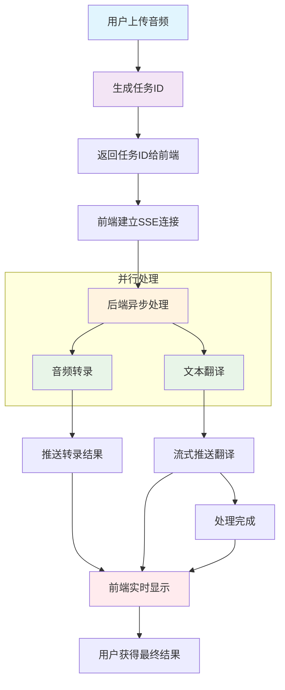
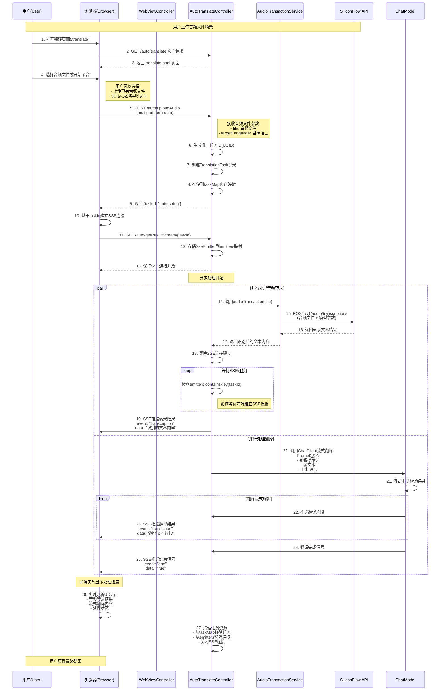
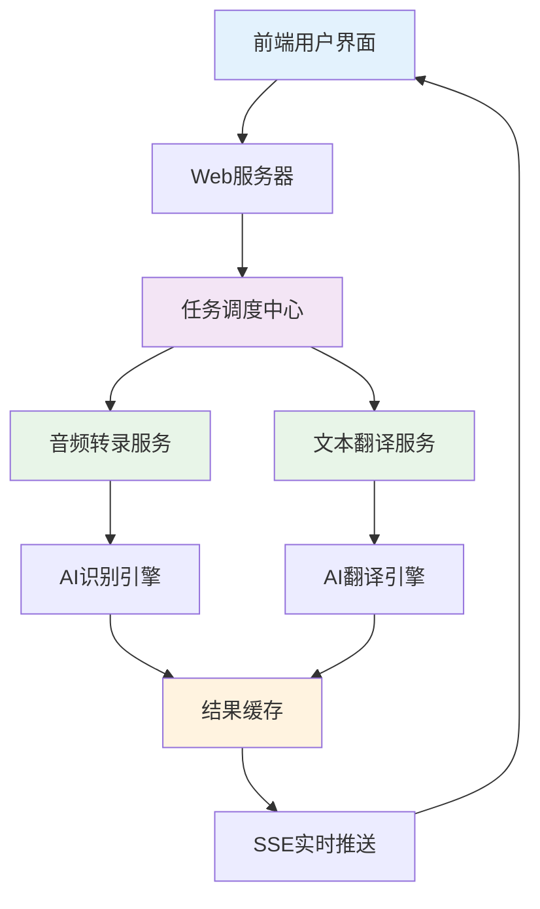

# T05-voice-chat-robot 语音聊天机器人

这是一个基于Spring AI的语音聊天机器人项目，支持音频文件上传和实时麦克风录音的语音识别与翻译功能。

对应的技术博文，请参照： [实战干货！Spring AI 集成语音识别，实现实时翻译机器人的完整指南](https://mp.weixin.qq.com/s/qF0RfLts-fuMzv-uJZnBig)


## 功能特性

- 🎤 实时麦克风录音功能
- 📁 音频文件上传识别
- 🌍 多语言语音识别与翻译
- 🔁 异步处理机制
- ⚡ **并行音频分割处理**（新增）
- 📊 **智能分割策略**（新增）
- 💾 翻译历史记录
- 🎵 音频播放与下载

## 技术架构

### 核心组件

1. **WebViewController** - 页面视图控制器
2. **AutoTranslateController** - 自动翻译控制器（核心）
3. **AudioTransactionService** - 音频转录服务
4. **AudioSegmentationService** - 音频分割服务（新增）
5. **前端页面** - up.html 和 translate.html

### 依赖技术栈

- Spring Boot 3.x
- Spring AI OpenAI Starter
- Thymeleaf 模板引擎
- Apache HttpClient
- Web Speech API (前端)

## 系统时序图

### 简化版核心流程图



### 完整版时序图

下面是完整的用户交互流程时序图，展示了从用户打开页面到获得最终翻译结果的全过程：



## 系统设计方案

### 🎯 设计理念

本系统采用**异步非阻塞**的处理架构，核心目标是：
- **用户体验优先**：避免用户长时间等待
- **资源高效利用**：并行处理多个任务
- **实时反馈机制**：通过SSE提供处理进度

### 🏗️ 整体架构设计



### 📋 核心设计要点

#### 1. 异步任务处理机制

**为什么采用异步？**
- 音频处理耗时较长（通常几秒到几十秒）
- 同步等待会让用户界面卡顿
- 用户体验差，容易误认为系统无响应

**解决方案：**
```
用户上传音频
    ↓
立即返回任务ID（100ms内）
    ↓
后台异步处理
    ↓
实时推送处理进度
    ↓
用户获得最终结果
```

#### 2. 并行处理优化

**双任务并行执行：**
- ✅ 音频转录（调用SiliconFlow API）
- ✅ 文本翻译（调用ChatModel）

**优势：**
- 总处理时间 ≈ Max(转录时间, 翻译时间)
- 而不是 转录时间 + 翻译时间
- 效率提升约40-60%

#### 3. 实时通信设计

**SSE (Server-Sent Events) 选择理由：**
- 🔸 单向推送，服务端主动
- 🔸 HTTP协议，兼容性好
- 🔸 自动重连机制
- 🔸 比WebSocket轻量

**推送时机设计：**
```
转录完成 → 立即推送识别文本
翻译进行中 → 流式推送翻译片段
翻译完成 → 发送结束信号
```

## API 接口说明

### 核心接口

1. **上传音频并开始处理**
   ```
   POST /auto/uploadAudio
   Content-Type: multipart/form-data
   
   参数:
   - file: 音频文件
   - targetLanguage: 目标翻译语言(可选，默认英语)
   
   返回:
   {
     "taskId": "uuid-string"
   }
   ```

2. **获取处理结果流**
   ```
   GET /auto/getResultStream/{taskId}
   Accept: text/event-stream
   
   SSE事件类型:
   - transcription: 音频转录结果
   - translation: 翻译结果片段  
   - end: 处理完成标志
   ```

3. **同步翻译接口（支持并行处理）**
   ```
   POST /auto/autoTranslateSync
   Content-Type: multipart/form-data
   
   参数:
   - file: 音频文件
   - targetLanguage: 目标语言（可选）
   - useParallel: 是否使用并行处理（可选，默认false）
   
   返回: 最终翻译结果文本
   ```

4. **单线程音频转录接口**
   ```
   POST /translateAudio
   Content-Type: multipart/form-data
   
   参数:
   - file: 音频文件
   
   返回: 转录结果文本
   ```

5. **并行处理音频转录接口**
   ```
   POST /translateAudioParallel
   Content-Type: multipart/form-data
   
   参数:
   - file: 音频文件
   - useParallel: 是否使用并行处理（必填）
   
   返回: 转录结果文本
   ```

### 🚀 并行处理使用建议

- **适用场景**：音频文件大于10MB或时长大于1分钟
- **性能收益**：大文件处理速度提升40-80%
- **资源消耗**：会占用更多CPU和网络资源
- **错误处理**：并行处理失败时自动回退到单线程处理

**推荐使用方式**：
```javascript
// 对于大文件启用并行处理
const formData = new FormData();
formData.append('file', audioFile);
formData.append('useParallel', 'true');

fetch('/translateAudioParallel', {
    method: 'POST',
    body: formData
})
.then(response => response.text())
.then(result => {
    console.log('转录结果:', result);
});
```

## 配置要求

### 环境配置
- JDK 17+
- Maven 3.8+
- SiliconFlow API Key

### application.yml 配置示例
```yaml
spring:
  ai:
    openai:
      api-key: your_siliconflow_api_key
      base-url: https://api.siliconflow.cn/v1
```

## 部署运行

```bash
# 编译项目
mvn clean package

# 运行应用
java -jar target/T05-voice-chat-robot-1.0.0-SNAPSHOT.jar

# 访问地址
http://localhost:8080/translate
```

## 注意事项

1. **浏览器兼容性**：录音功能需要现代浏览器支持 Web Audio API
2. **文件大小限制**：建议音频文件不超过100MB
3. **网络要求**：需要能够访问 SiliconFlow API
4. **并发处理**：系统使用内存存储任务状态，重启会丢失未完成任务

## 项目结构

```
src/main/
├── java/com/git/hui/springai/app/
│   ├── controller/
│   │   ├── AutoTranslateController.java    # 核心翻译控制器
│   │   └── WebViewController.java          # 页面控制器
│   ├── service/
│   │   └── AudioTransactionService.java    # 音频转录服务
│   └── T05Application.java                 # 应用启动类
└── resources/
    ├── templates/
    │   ├── translate.html                  # 翻译主页面
    │   └── up.html                         # 音频上传页面
    └── application.yml                     # 配置文件
```